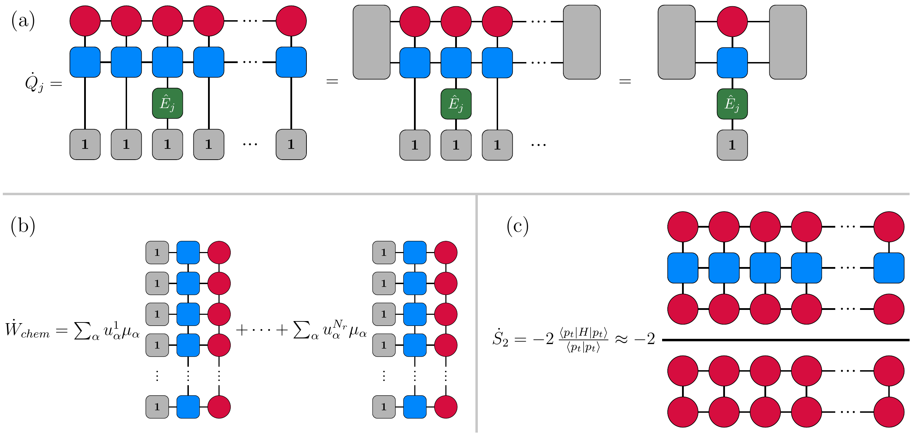

# Thermodynamics of Stochastic Biochemical Processes: a Tensor Network Approach
This repository implements the tensor network methods shown in 

>**Thermodynamics of Stochastic Biochemical Processes: a Tenosr Network Approach**
>Schuyler B. Nicholson, Luis Pedro García-Pintos
>[arXiv:2512.19616](https://arxiv.org/abs/2512.19616)

---

## Overview 
Calculating thermodynamic observables at the level of the chemical master equation is a fundamental challenge due to the curse of dimensionality, where mathematically exact solutions of many-body systems become exponentially expensive to solve. By writing observables such as rates of entropy production, heat flux and chemical work into the language of tensor networks we circumvent the curse of dimensionality while also not requiring assumptions about system noise or resorting to sampling method and their inherent limitations.

<p align="center">
  
  <br>
  <em>Figure 1: Tensor network representations for the thermodynamic rates of heat flux, chemical work, and the Renyi-2 entropy rate.</em>
</p>


# Installation
Required packages can be added using the Julia package manager. From the Julia Repl, type `]` to enter the package manager and run for example,
```julia
julia> ]

pkg> add ITensors
```
# Usage
Results from the paper can be reproduced by running files from the ``Experiments`` directory.

Results are generated by running ``Evolve_SAModel_MPS.jl`` which builds and evolves a stochastic version of the dissipative self-assembly model found in [Penocchio et al 2019](https://www.nature.com/articles/s41467-019-11676-x).
